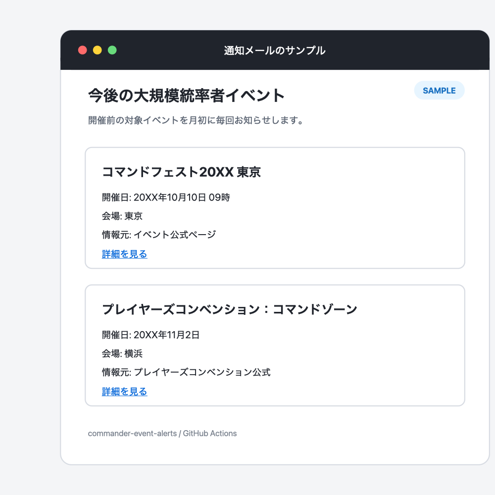

# Commander Event Alerts

[](https://github.com/seeton/commander-event-alerts/actions/workflows/test.yml)
[](LICENSE)

日本国内の**大規模な統率者イベントだけ**を毎月1日にチェックし、その時点で開催前のイベントをメールで知らせる GitHub Actions です。

[このテンプレートから自分用のリポジトリを作る](https://github.com/seeton/commander-event-alerts/generate)



## 通知するイベント

イベント名から大規模開催と判断できるものに限定しています。

- コマンドフェスト / CommandFest
- コマンダーサミット / コマサミ / コマサミサーガ
- プレイヤーズコンベンションのコマンドゾーン / Command Zone

毎週の店舗イベント、コマンダー交流会、コマンダー・パーティー、開催後のレポートは通知しません。

通知は「新しく見つけたときの1回だけ」ではありません。開催前であれば月初ごとに同じイベントを再通知します。例えば10月10日のイベントが8月に発表済みなら、8月・9月・10月の月初に届きます。

## 料金

個人利用なら基本的に無料です。

- GitHub Actions: PrivateリポジトリでもGitHub Freeの無料利用枠内で十分に動かせます
- Resend: Freeプランは月3,000通・1日100通までです

料金や上限は変更されることがあります。最新情報は [GitHub Actionsの料金](https://docs.github.com/en/billing/concepts/product-billing/github-actions) と [Resendの料金](https://resend.com/pricing) を確認してください。

## セットアップ

### 1. 自分用のリポジトリを作る

上部の **Use this template**、または[このリンク](https://github.com/seeton/commander-event-alerts/generate)からリポジトリを作ります。

通知専用なら **Private** がおすすめです。Privateでもこの処理量なら通常はGitHub Actionsの無料枠内に収まります。また、公開リポジトリでは[60日間活動がないと定期実行が自動停止される](https://docs.github.com/en/actions/how-tos/manage-workflow-runs/disable-and-enable-workflows)ことがあります。

### 2. ResendのAPIキーを作る

個人メールのSMTPアカウントは使いません。通知専用の [Resend](https://resend.com/) APIを利用します。

1. 通知を受け取りたいメールアドレスでResendに登録する
2. Resendの **API Keys** から送信専用のAPIキーを作る
3. `re_` で始まるAPIキーを、安全な場所に一時保存する

独自ドメインを登録しない場合、`onboarding@resend.dev` から送信できるのは**Resendアカウント本人のメールアドレスだけ**です。そのため、Resendの登録アドレスと通知先は同じものを使ってください。これは[Resend公式の制限](https://resend.com/docs/knowledge-base/403-error-resend-dev-domain)です。

### 3. GitHub Secretsを登録する

自分用リポジトリの **Settings → Secrets and variables → Actions → New repository secret** で、次の2つを登録します。

| Secret | 値 |
|---|---|
| `RESEND_API_KEY` | `re_` で始まるResendのAPIキー |
| `MAIL_TO` | Resendに登録したメールアドレス |

独自ドメインをResendに追加した場合だけ、任意で `RESEND_FROM` も登録できます。

| Optional secret | 値の例 |
|---|---|
| `RESEND_FROM` | `Commander Events <alert@example.com>` |

メールアドレスとAPIキーは `config.json` やソースコードに書かないでください。Repository secretsに保存した値は、公開リポジトリでもリポジトリの画面やファイルには表示されません。ただしワークフローは実行時に値を利用できるため、信頼できないワークフロー変更を取り込まないでください。

### 4. テストメールを送る

1. GitHubの **Actions → Commander Event Alert** を開く
2. Actionsが無効なら **I understand my workflows, go ahead and enable them** を押す
3. **Run workflow** を開く
4. **Send only a test email** をオンにして実行する
5. テストメールが届いたら、同じ画面からオフのままもう一度実行する

オフで実行すると、その時点で開催前の対象イベントをまとめてメールします。定期確認は毎月1日 09:15 JSTです。

## 通知対象を変える

[`config.json`](config.json) の `include_terms` と `exclude_terms` を編集します。`include_terms` は誤通知を防ぐため、イベントの固有名だけを入れるのがおすすめです。

ローカルでメールを送らず、検出結果だけを確認できます。

```bash
python3 src/commander_alert.py
python3 -m unittest discover -s tests -v
```

## 情報元

- [晴れる屋イベント検索](https://www.hareruyamtg.com/ja/events/list)
- [マジック：ザ・ギャザリング日本公式](https://mtg-jp.com/)
- [プレイヤーズコンベンション公式](https://ssl.bigmagic.net/players_convention/)

外部パッケージや有料APIは使わず、公開ページを取得して固有イベント名で絞り込み、開催日が過ぎたイベントを除外しています。メール送信だけResend APIを使います。

## 制約と免責

- 本プロジェクトは非公式で、Wizards of the Coast、晴れる屋、BIG MAGIC、その他イベント主催者とは関係ありません
- 情報元サイトの変更、掲載表記、通信障害などにより、取得漏れや誤検出が発生する可能性があります
- メールだけで参加可否を判断せず、必ずリンク先の公式情報を確認してください
- GitHub Actionsの定期実行は遅延する場合があります
- 公開リポジトリでは、[60日間活動がないとscheduled workflowが自動停止されます](https://docs.github.com/en/actions/how-tos/manage-workflow-runs/disable-and-enable-workflows)。個人用コピーはPrivateを推奨します

不具合や対象イベントの提案は [Issues](https://github.com/seeton/commander-event-alerts/issues) へどうぞ。ただし、メールアドレスやAPIキーはIssueに書かないでください。

## ライセンス

[MIT License](LICENSE)
